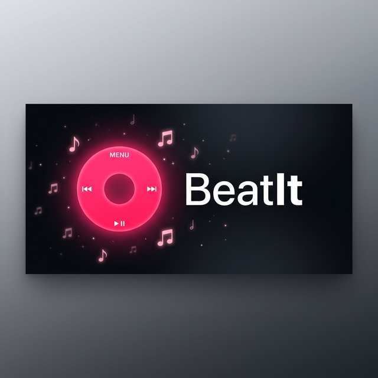

<p align="center">
  
</p>

<h1 align="center">🎵 BeatIt</h1>

<p align="center">
  <strong>A retro iPod-inspired Android music downloader with Spotify integration</strong>
</p>

<p align="center">
  <a href="https://github.com/Arnav1343/BeatIt/raw/main/BeatIt.apk">
    
  </a>
  
  
  
</p>

<p align="center">
  
  
  
</p>

---

## ✨ Features

| Feature | Description |
|---------|-------------|
| 🎧 **iPod Classic UI** | Pixel-accurate retro interface with a working click wheel, smooth animations, and light/dark themes |
| 🟢 **Spotify Integration** | Connect your Spotify account to browse and import your playlists directly |
| 📥 **Batch Import** | Import entire playlists from Spotify — auto-matches tracks on YouTube and downloads them |
| 🔍 **YouTube Search** | Search for any song by name and preview results before downloading |
| 💾 **High-Quality Downloads** | Choose between MP3 (128–320 kbps) or Opus codec for optimal quality |
| ⚡ **Segmented Downloads** | Multi-threaded download engine for maximum speed |
| 📚 **Local Library** | Browse and play downloaded music with a built-in audio player |
| 🎨 **Themes** | Switch between classic iPod light and dark modes |

---

## 📱 Screenshots

<p align="center">
  <em>iPod-inspired UI with working click wheel navigation, Spotify playlist browser, and batch import system</em>
</p>

---

## 🚀 Quick Start

### Download & Install

1. **Download** the latest APK from the [Releases](https://github.com/Arnav1343/BeatIt/raw/main/BeatIt.apk)
2. **Enable** "Install from unknown sources" in Android Settings
3. **Install** and open BeatIt

### Connect Spotify *(Optional)*

1. Open the app → Navigate to **Menu → Spotify**
2. Tap **Connect** to link your Spotify account
3. Browse your playlists and tap to import

---

## 🏗️ Architecture

BeatIt runs as a **self-contained Android app** with a local web server powering the UI:

```
┌─────────────────────────────────────────┐
│              Android App                │
│                                         │
│  ┌──────────┐    ┌──────────────────┐   │
│  │ WebView  │◄──►│  NanoHTTPD       │   │
│  │ (iPod UI)│    │  Local Server    │   │
│  └──────────┘    └───────┬──────────┘   │
│                          │              │
│  ┌───────────────────────┼───────────┐  │
│  │              Core Engine          │  │
│  │                                   │  │
│  │  SpotifyAuth    SpotifyClient     │  │
│  │  YouTubeHelper  DownloadManager   │  │
│  │  BatchManager   PlaylistExtractor │  │
│  │  TrackMapper    SegmentedDownload │  │
│  └───────────────────────────────────┘  │
│                                         │
│  ┌───────────────────────────────────┐  │
│  │           Room Database           │  │
│  │  Batches · Tracks · Status        │  │
│  └───────────────────────────────────┘  │
└─────────────────────────────────────────┘
```

### Key Components

| Component | Purpose |
|-----------|---------|
| `BeatItServer.kt` | NanoHTTPD server — serves UI and handles all API routes |
| `SpotifyAuth.kt` | PKCE OAuth flow for Spotify authentication |
| `SpotifyClient.kt` | Spotify API client + embed page scraper for track extraction |
| `YoutubeHelper.kt` | YouTube search and stream extraction via NewPipe Extractor |
| `BatchManager.kt` | State machine for batch import (extract → match → download) |
| `PlaylistExtractor.kt` | Multi-platform playlist parsing (Spotify, YouTube) |
| `SegmentedDownloader.kt` | Multi-threaded HTTP download engine |
| `DownloadManager.kt` | Download queue with progress tracking |
| `TrackMapper.kt` | Maps Spotify tracks to YouTube search queries |

---

## 🔧 Build from Source

### Prerequisites

- **Android Studio** Hedgehog or later
- **JDK 17+**
- **Android SDK 34**

### Build

```bash
# Clone the repository
git clone https://github.com/Arnav1343/BeatIt.git
cd BeatIt

# Build debug APK
cd android
./gradlew assembleDebug

# APK output
# → android/app/build/outputs/apk/debug/app-debug.apk
```

---

## 🛠️ Tech Stack

| Layer | Technology |
|-------|-----------|
| **Language** | Kotlin 2.0 |
| **UI** | HTML/CSS/JS served via WebView |
| **Local Server** | NanoHTTPD |
| **Database** | Room (SQLite) |
| **Networking** | OkHttp 4 |
| **JSON** | Gson |
| **Audio Extraction** | NewPipe Extractor |
| **Auth** | Spotify PKCE OAuth 2.0 |

---

## 📋 How It Works

### Playlist Import Flow

```
Spotify Playlist URL
       │
       ▼
 ┌─────────────┐     ┌──────────────┐     ┌─────────────┐
 │   Extract    │────►│  Match on    │────►│  Download    │
 │   Tracks     │     │  YouTube     │     │  Audio       │
 └─────────────┘     └──────────────┘     └─────────────┘
       │                    │                     │
  Spotify Embed       Auto-search            Segmented
  Page Scraper       "Artist - Title"        Downloader
```

1. **Extract** — Fetches track list from Spotify's embed page (no API key limits)
2. **Match** — Searches YouTube for each track using `"Artist - Title"` query
3. **Review** — Shows matched results for user approval / manual rematch
4. **Download** — Downloads audio in chosen codec with multi-threaded segments

---

## 📄 License

This project is licensed under the MIT License — see the [LICENSE](LICENSE) file for details.

---

<p align="center">
  Made with ❤️ and a love for retro music players
</p>
